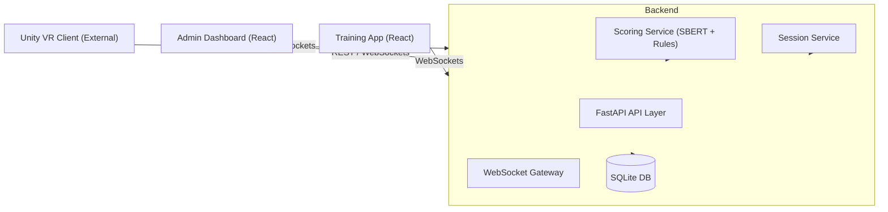

# System Architecture

The Reflex Training AI system is designed as a distributed PoC for automotive sales training. It leverages a modern, async-first backend and reactive frontends to provide a seamless training experience.

## System Overview

The system consists of three primary components interacting through REST and WebSockets:

1.  **Backend (FastAPI)**: The central hub for session management, AI scoring, and data persistence.
2.  **Admin Dashboard (React)**: A monitoring tool for instructors to view live training sessions and historical performance.
3.  **Training App (React)**: A production-grade tool for validating the AI scoring logic and simulating client interactions.

## High-Level Architecture Diagram

## Component Breakdowns

### 1. Backend
-   **Language**: Python 3.11+
-   **Framework**: FastAPI (Async/Await)
-   **Database**: SQLite (SQLAlchemy ORM)
-   **AI Engine**: SBERT (Sentence-Transformers) for semantic analysis + Keyword heuristic rules.
-   **Communication**: 
    -   JWT-based authentication for Admin access.
    -   WebSockets for real-time bi-directional messaging (Session flow & Admin broadcast).

### 2. Admin Dashboard
-   **Tech Stack**: Vite + React + TypeScript + Tailwind CSS.
-   **Features**:
    -   Historical session review.
    -   Live feed of ongoing sessions using WebSocket broadcasting.
    -   Visual performance indicators (Intent labels, scoring heatmaps).

### 3. Training App
-   **Tech Stack**: Vite + React + TypeScript.
-   **Utility**: 
    -   Simulation of the `unity` role for testing storyline flows.
    -   Ad-hoc scoring testing via the `test_query` message.

### 4. ML Pipeline
-   **Purpose**: A separate pipeline to train custom intent classifiers.
-   **Process**: Scrape/Prepare data -> Embed with SBERT -> Train Logistic Regression -> Export `.joblib` model.

## Data Flow: Roleplay Session

1.  **Initialization**: Client connects to `/ws?role=unity` and sends `session_start`.
2.  **Interaction**: 
    -   Backend sends initial `client_utterance`.
    -   User responds; Client sends `roleplay_event`.
3.  **Processing**:
    -   Backend validates session state using `asyncio.Lock`.
    -   Scoring service classifies response (e.g., `Isolate`, `Empathy`) and generates feedback.
    -   Result persists in SQLite.
4.  **Feedback**:
    -   Backend sends `score_event` and next `client_utterance` to the Client.
    -   Backend broadcasts the event to all connected `admin` clients.
5.  **Completion**: On final step, `session_summary` is generated and broadcasted.
